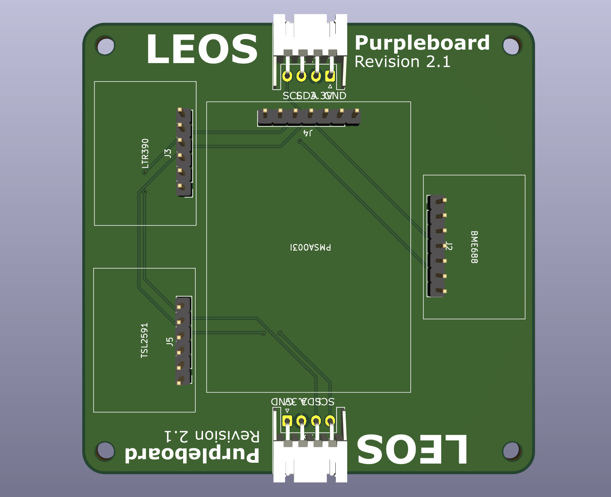

# LEOS Purpleboard

The Purpleboard holds four environmental and light sensor breakout boards on a shared I²C bus, powered at 3.3 V. The board has no microcontroller: it connects to a host board through a JST XH cable, and a second JST XH connector passes the I²C bus and power through to another board.

**Current revision:** 2.1

## Sensors

| Ref | Sensor | Measures | Header | Default I²C address |
|-----|--------|----------|--------|---------------------|
| J2 | BME688 | Temperature, humidity, pressure, gas | 7-pin | 0x77 |
| J3 | LTR390 | UV and ambient light | 6-pin | 0x53 |
| J4 | PMSA003I | Air Quality (PM1.0, PM2.5, PM10) | 7-pin | 0x12 |
| J5 | TSL2591 | High-dynamic-range light | 6-pin | 0x29 |

Each sensor is a breakout board that plugs into a pin header. All four share the same SCL and SDA lines, and their default addresses do not conflict.

## Connectors

J1 (Board Input) and J6 (Board Output) are 4-pin JST XH connectors wired in parallel, so boards can be daisy-chained. They follow the STEMMA pinout, but use JST XH instead of JST PH to match the convention on other LEOS boards.

| Pin | Signal |
|-----|--------|
| 1 | GND |
| 2 | +3.3 V |
| 3 | SDA |
| 4 | SCL |

## Sensor header wiring

- **VIN** on every header is connected to +3.3 V, and **GND** to ground.
- **SCL/SDA** are connected to the shared I²C bus. On the BME688 these are the SCK and SDI pins.
- Not connected: the 3V output pins on all breakouts, BME688 SDO and CS, LTR390 INT, TSL2591 INT, and PMSA003I RST and SET.
